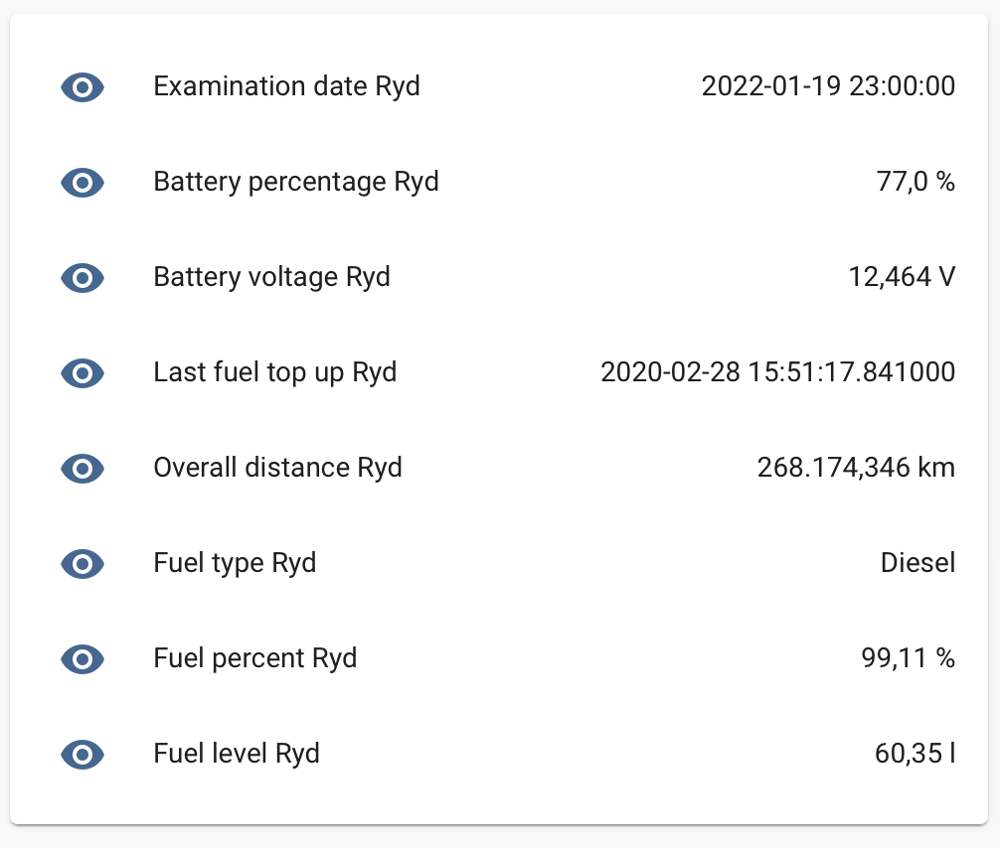
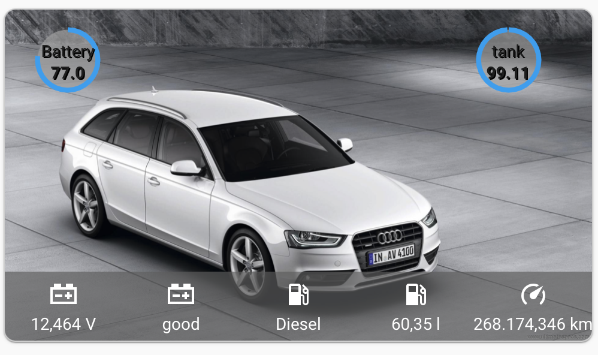

[](https://github.com/custom-components/hacs)

# RYD Custom Component for Home Assistant

Still work in progress

Based on the [ioBroker component by @NemoN](https://github.com/NemoN/ioBroker.ryd)

Also thank you [@nielstron](https://github.com/nielstron) for always correcting my mess :)
  
## Installation

Add this repository to [hacs](https://hacs.xyz/) or copy the `custom_component/ryd` file structure into your custom_component directory .

## Example configuration

```yaml
# Configuration for the RYD component
sensor:
  - platform: ryd
    url: https://tt4.thinxcloud.de
    email: your@email.here
    password: your_secret_password_here
    scan_interval: optional_scan_interval
```

## The result:

Entities                   |  Custom Card
:-------------------------:|:-------------------------:
   |  


The second card which is taken from: https://github.com/arjenvrh/audi_connect_ha requires the following mods: 

https://github.com/thomasloven/lovelace-card-mod

https://github.com/custom-cards/circle-sensor-card

The small gray background image at the bottom is a svg image which does not have to be copied to the www folder, the relevant code was generated with: https://yoksel.github.io/url-encoder/ and minified with https://www.svgminify.com

and the following configuration:

```yaml
type: picture-elements
image: /local/a4-b8.jpg
card_mod:
  style: |
    ha-card {
      border-radius: 10px;
      border: solid 1px rgba(100,100,100,0.3);
      overflow: hidden;
    } 
elements:
  - type: image
    image: >-
      data:image/svg+xml,%3C%3Fxml version='1.0'
      encoding='UTF-8'%3F%3E%3C!DOCTYPE svg PUBLIC '-//W3C//DTD SVG 1.1//EN'
      'http://www.w3.org/Graphics/SVG/1.1/DTD/svg11.dtd'%3E%3Csvg version='1.1'
      viewBox='0 0 500 150' xml:space='preserve'
      xmlns='http://www.w3.org/2000/svg'%3E%3Cdesc%3ECreated with Fabric.js
      4.2.0%3C/desc%3E%3Cg transform='translate(250 75)'%3E%3Crect x='-250'
      y='-75' width='500' height='150' rx='0' ry='0' fill='%23676767'
      fill-opacity='.68'
      vector-effect='non-scaling-stroke'/%3E%3C/g%3E%3C/svg%3E%0A
    style:
      left: 50%
      top: 90%
      width: 100%
      height: 60px
  - type: icon
    icon: 'mdi:car-battery'
    entity: sensor.battery_voltage_ryd
    tap_action: more_info
    style:
      color: white
      left: 10%
      top: 86%
  - type: state-label
    entity: sensor.battery_voltage_ryd
    style:
      color: white
      left: 10%
      top: 95%
  - type: icon
    icon: 'mdi:car-battery'
    entity: sensor.battery_health_ryd
    tap_action: more_info
    style:
      color: white
      left: 30%
      top: 86%
  - type: state-label
    entity: sensor.battery_health_ryd
    style:
      color: white
      left: 30%
      top: 95%
  - type: icon
    icon: 'mdi:gas-station'
    entity: sensor.fuel_type_ryd
    tap_action: more_info
    style:
      color: white
      left: 50%
      top: 86%
  - type: state-label
    entity: sensor.fuel_type_ryd
    style:
      color: white
      left: 50%
      top: 95%
  - type: icon
    icon: 'mdi:gas-station'
    entity: sensor.fuel_level_ryd
    tap_action: more_info
    style:
      color: white
      left: 70%
      top: 86%
  - type: state-label
    entity: sensor.fuel_level_ryd
    style:
      color: white
      left: 70%
      top: 95%
  - type: icon
    icon: 'mdi:speedometer'
    entity: sensor.overall_distance_ryd
    tap_action: more_info
    style:
      color: white
      left: 90%
      top: 86%
  - type: state-label
    entity: sensor.overall_distance_ryd
    style:
      color: white
      left: 90%
      top: 95%
  - type: 'custom:circle-sensor-card'
    entity: sensor.fuel_percent_ryd
    max: 100
    min: 0
    stroke_width: 15
    gradient: true
    fill: '#aaaa'
    name: tank
    units: ' '
    font_style:
      font-size: 1.0em
      font-color: white
    style:
      top: 5%
      left: 80%
      width: 4em
      height: 4em
      transform: none
  - type: 'custom:circle-sensor-card'
    entity: sensor.battery_percentage_ryd
    max: 100
    min: 0
    stroke_width: 15
    gradient: true
    fill: '#aaaa'
    name: Battery
    units: ' '
    font_style:
      font-size: 1.0em
      font-color: white
    style:
      top: 5%
      left: 5%
      width: 4em
      height: 4em
      transform: none
```
