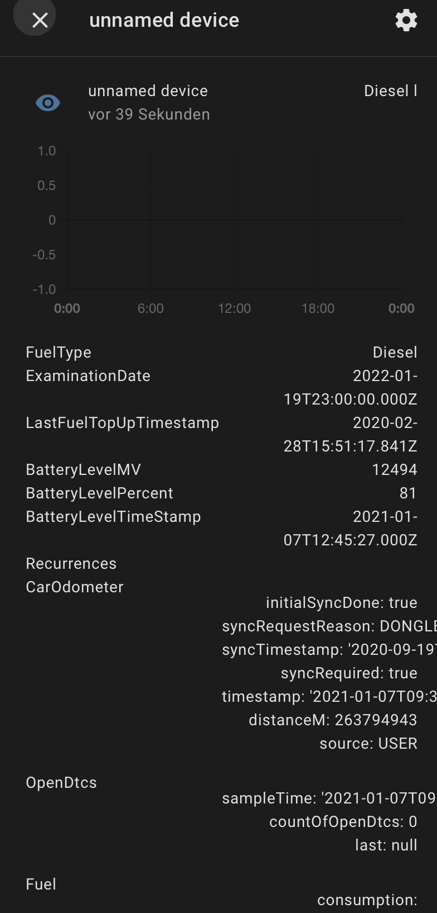

[](https://github.com/custom-components/hacs)

# RYD Custom Component for Home Assistant

Still work in progress

Based on the [ioBroker component by @NemoN](https://github.com/NemoN/ioBroker.ryd)

Also thank you [@nielstron](https://github.com/nielstron) for always correcting my mess :)

planned:
  - [ ] put information in seperate sensors or make one general sensor
  - [ ] add scan_interval
  - [x] make component available via HACS
  
## Installation

Add this repository to [hacs](https://hacs.xyz/) or copy the `custom_component/ryd` file structure into your custom_component directory .

## Example configuration

```yaml
# Configuration for the RYD component
sensor:
  - platform: ryd
    url: https://tt4.thinxcloud.de
    email: your@email.here
    password: your_secret_password_here
```

The sensors name is `sensor.unnamed_device` (will be fixed)

The result for now is not pretty but you can read all information:


